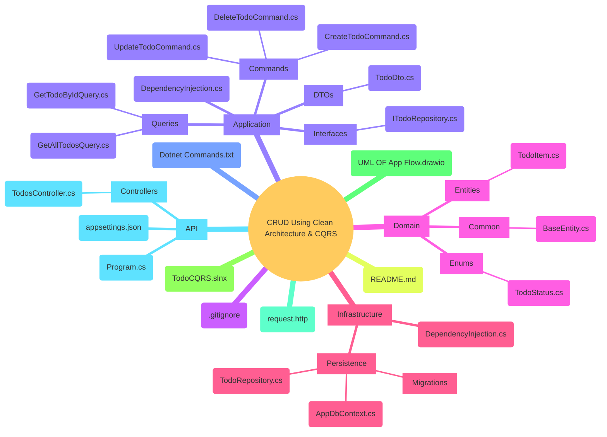

# CRUD Application using Clean Architecture & CQRS

This project is a practical implementation of a modern **CRUD (Create, Read, Update, Delete)** application. It demonstrates the powerful combination of **Clean Architecture** and the **CQRS (Command and Query Responsibility Segregation)** pattern using **C#** and **.NET**.

The primary goal is to showcase a maintainable, scalable, and testable backend structure by clearly separating concerns and handling data operations efficiently.

## 📖 Description

The application is built around a simple "Todo" item domain to illustrate core concepts. It handles basic operations like creating, reading, updating, and deleting todo items. The architecture is split into distinct layers (Presentation, Application, Domain, Infrastructure), each with a specific responsibility. CQRS is implemented using **MediatR**, which decouples the request/response pipeline by separating write operations (Commands) from read operations (Queries).

## ✨ Features

- **Full CRUD Operations:** Complete backend API endpoints for managing todo items.
- **Clean Architecture:** Strict separation of concerns into `API`, `Application`, `Domain`, and `Infrastructure` projects.
- **CQRS Pattern:** Clear separation of read and write logic using Commands and Queries.
- **MediatR Integration:** Handles the dispatching of commands and queries, reducing coupling.
- **API Testing:** Includes a `request.http` file for easy endpoint testing directly from your IDE (like VS Code or Visual Studio).
- **Architecture Visualization:** Comes with a UML diagram (`UML OF App Flow.drawio`) to visualize the application's flow.

## 🛠️ Technology Stack

- **Framework:** .NET (Latest version, as indicated by the project structure)
- **Language:** C#
- **Architecture:** Clean Architecture
- **Pattern:** CQRS with Mediator (MediatR library)
- **Database:** (Implied, but not specified. Could be Entity Framework Core, likely configured in the `Infrastructure` layer.)

## 📂 Project Structure

The solution is organized into four main projects, following Clean Architecture principles:



### Layer Responsibilities

1. **Domain (Core):** Contains enterprise-wide business logic and entities. It has no external dependencies.
2. **Application:** Holds all application-specific logic and use cases. It orchestrates the flow of data to and from the domain, relying on interfaces defined here (Dependency Inversion).
3. **Infrastructure:** Implements the interfaces defined in the Application layer. This includes data access (e.g., Entity Framework Core), file system access, email sending, etc.
4. **API:** The presentation layer. It contains the Controllers and the application's entry point. It depends on both the Application and Infrastructure layers.

## 🚀 Getting Started

### Prerequisites

- [.NET SDK](https://dotnet.microsoft.com/download) (Latest version recommended)
- A code editor or IDE (like Visual Studio 2022+, VS Code, or Rider)

### Installation & Setup

1. **Clone the repository**

   ```bash
   git clone https://github.com/YoussefS3eed/CRUD-Using-Clean-Architecture-and-CQRS.git
   cd CRUD-Using-Clean-Architecture-and-CQRS
   ```

2. **Restore dependencies**

   ```bash
   dotnet restore
   ```

3. **Update Database (Migrations)**
   - _(Note: If Entity Framework is used, navigate to the `Infrastructure` or `API` project directory and run:)_

   ```bash
   dotnet ef database update
   ```

   _Ensure the connection string in `appsettings.json` is correctly configured._

4. **Run the application**

   ```bash
   dotnet run --project API
   ```

## 🧪 Testing the API

The project includes a `request.http` file. If you are using Visual Studio 2022 or VS Code with the **REST Client** extension, you can open this file and send requests directly to the API to test all CRUD endpoints.

Alternatively, you can use tools like **Postman** or **Swagger** (if configured) to interact with the API. The default base URL is typically `https://localhost:5001` or `http://localhost:5000`.

### Example Endpoints (likely available)

- `GET /api/todos` - Get all todo items.
- `GET /api/todos/{id}` - Get a specific todo item by ID.
- `POST /api/todos` - Create a new todo item.
- `PUT /api/todos/{id}` - Update an existing todo item.
- `DELETE /api/todos/{id}` - Delete a todo item.

## 📊 UML Diagram

A visual representation of the application's flow can be found in the `UML OF App Flow.drawio` file. You can open this file with [diagrams.net](https://www.diagrams.net/) (formerly draw.io) to understand how data and requests travel through the different layers of the Clean Architecture.

## 🤝 Contributing

Contributions are what make the open-source community such an amazing place to learn, inspire, and create. Any contributions you make are **greatly appreciated**.

1. Fork the Project
2. Create your Feature Branch (`git checkout -b feature/AmazingFeature`)
3. Commit your Changes (`git commit -m 'Add some AmazingFeature'`)
4. Push to the Branch (`git push origin feature/AmazingFeature`)
5. Open a Pull Request

## 📝 License

Distributed under the MIT License. See `LICENSE` for more information. (Note: A license file is not present in the repository; consider adding one).

## 📧 Contact

Youssef Saeed - [yousaeed2020@gmail.com]
