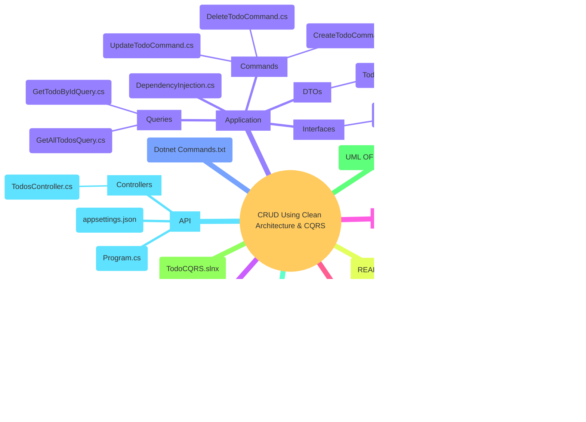

<div align="center">

# 🏗️ CRUD Application using Clean Architecture & CQRS

**A practical, real-world implementation of a modern CRUD application demonstrating the power of Clean Architecture and the CQRS pattern in .NET.**

[](https://dotnet.microsoft.com/)
[](https://docs.microsoft.com/en-us/dotnet/csharp/)
[]()
[]()
[]()

</div>

---

## 📖 Overview

The primary goal of this repository is to showcase a **maintainable**, **scalable**, and **testable** backend structure by clearly separating concerns and handling data operations efficiently. Built around a simple "Todo" item domain, it illustrates core architectural concepts without being bogged down by complex business logic.

The application handles basic operations (Create, Read, Update, Delete) while strictly adhering to layered design (Presentation, Application, Domain, Infrastructure). CQRS is elegantly implemented using **MediatR**, decoupling the request/response pipeline by separating write operations (Commands) from read operations (Queries).

## 🚀 Key Features

*   🌍 **Full CRUD Operations:** Complete backend API RESTful endpoints.
*   🏛️ **Clean Architecture:** Strict separation of concerns (`API`, `Application`, `Domain`, `Infrastructure`).
*   ⚖️ **CQRS Pattern:** Clear isolation of read and write logic via Commands and Queries.
*   📨 **MediatR Integration:** Seamless in-process messaging for dispatching commands and queries.
*   🧪 **Developer Experience:** Includes a `request.http` file for instant endpoint testing directly from your IDE.
*   📊 **Architecture Visualization:** Accompanied by a UML diagram (`UML OF App Flow.drawio`) detailing the application flow.

---

## 🛠️ Technology Stack

| Category | Technology |
| :--- | :--- |
| **Framework** | .NET (Latest version) |
| **Language** | C# |
| **Architecture** | Clean Architecture |
| **Design Pattern** | CQRS (Command Query Responsibility Segregation) |
| **Messaging** | MediatR |
| **Data Access** | Entity Framework Core (Configured in Infrastructure layer) |

---

## 📂 Architecture & Project Structure

The solution embraces Clean Architecture principles, ensuring the core business logic is independent of frameworks, UI, and external agencies.


```mermaid
%%{init: {"theme":"base","themeVariables":{"background":"#ffffff"}}}%%
mindmap
  root(("CRUD Using Clean Architecture & CQRS"))
    (.gitignore)
    (Dotnet Commands.txt)
    (README.md)
    (TodoCQRS.slnx)
    (UML OF App Flow.drawio)
    (request.http)
    [API]
      [Controllers]
        (TodosController.cs)
      (Program.cs)
      (appsettings.json)
    [Application]
      [Commands]
        (CreateTodoCommand.cs)
        (UpdateTodoCommand.cs)
        (DeleteTodoCommand.cs)
      [Queries]
        (GetAllTodosQuery.cs)
        (GetTodoByIdQuery.cs)
      [DTOs]
        (TodoDto.cs)
      [Interfaces]
        (ITodoRepository.cs)
      (DependencyInjection.cs)
    [Domain]
      [Entities]
        (TodoItem.cs)
      [Common]
        (BaseEntity.cs)
      [Enums]
        (TodoStatus.cs)
    [Infrastructure]
      [Persistence]
        (AppDbContext.cs)
        [Migrations]
        (TodoRepository.cs)
      (DependencyInjection.cs)
```

### 🧱 Layer Responsibilities

<details>
<summary><strong>1. Domain Layer (Core)</strong></summary>
<br>
Contains enterprise-wide business logic and entities. It represents the heart of the software and has <strong>zero external dependencies</strong>.
</details>

<details>
<summary><strong>2. Application Layer</strong></summary>
<br>
Holds all application-specific logic, use cases, and CQRS handlers. It orchestrates the flow of data to and from the domain, relying extensively on interfaces defined here (Dependency Inversion).
</details>

<details>
<summary><strong>3. Infrastructure Layer</strong></summary>
<br>
Implements the interfaces defined in the Application layer. This includes data access components (Entity Framework Core DbContext, Repositories), file system access, and external services.
</details>

<details>
<summary><strong>4. API Layer (Presentation)</strong></summary>
<br>
The entry point of the application. It hosts the RESTful Controllers, configures the dependency injection container, and depends on both the Application and Infrastructure layers to function.
</details>

---

## 🚦 Getting Started

Follow these instructions to get a copy of the project up and running on your local machine for development and testing purposes.

### Prerequisites

*   [.NET SDK](https://dotnet.microsoft.com/download) (Latest version recommended)
*   IDE: Visual Studio 2022+, JetBrains Rider, or VS Code.

### Installation & Setup

1.  **Clone the repository:**
    ```bash
    git clone https://github.com/YoussefS3eed/CRUD-Using-Clean-Architecture-and-CQRS.git
    cd CRUD-Using-Clean-Architecture-and-CQRS
    ```

2.  **Restore dependencies:**
    ```bash
    dotnet restore
    ```

3.  **Update Database (Migrations):**
    *(If using Entity Framework Core, navigate to the project directory containing your migrations or run from the solution root specifying projects)*
    ```bash
    dotnet ef database update --project Infrastructure --startup-project API
    ```
    _Ensure the connection string in `API/appsettings.json` is correctly configured._

4.  **Run the application:**
    ```bash
    dotnet run --project API
    ```

---

## 🧪 Testing the API

### Using `request.http`
This project includes a handy `request.http` file. With the **REST Client** extension in VS Code or Visual Studio 2022+, you can open this file and execute HTTP requests instantly against all CRUD endpoints.

### Using Swagger / Postman
Alternatively, you can navigate to the Swagger UI (if configured) or use Postman.

**Example Endpoints:** Default base URL is typically `https://localhost:71xx` or `http://localhost:5xxx`.

| Method   | Endpoint | Description |
| :------- | :------- | :---------- |
| `GET`    | `/api/todos` | Retrieve all todo items. |
| `GET`    | `/api/todos/{id}` | Retrieve a specific todo item by its ID. |
| `POST`   | `/api/todos` | Create a new todo item. |
| `PUT`    | `/api/todos/{id}` | Update an existing todo item. |
| `DELETE` | `/api/todos/{id}` | Remove a todo item. |

---

## 🤝 Contributing

Contributions are what make the open-source community such an amazing place to learn, inspire, and create. Any contributions you make are **greatly appreciated**.

1.  **Fork** the Project
2.  **Create** your Feature Branch (`git checkout -b feature/AmazingFeature`)
3.  **Commit** your Changes (`git commit -m 'Add some AmazingFeature'`)
4.  **Push** to the Branch (`git push origin feature/AmazingFeature`)
5.  **Open** a Pull Request

---

## 📝 License

Distributed under the MIT License. See `LICENSE` for more information. *(Note: Consider adding a LICENSE file if one is not present).*

## 📧 Contact

**Youssef Saeed** - [yousaeed2020@gmail.com](mailto:yousaeed2020@gmail.com)

Project Link: [CRUD-Using-Clean-Architecture-and-CQRS](https://github.com/YoussefS3eed/CRUD-Using-Clean-Architecture-and-CQRS)
